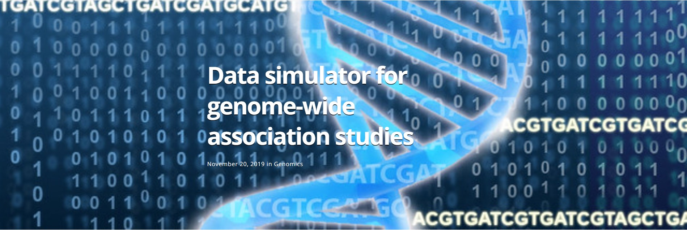

---

---



My research requires simulated genome-wide association study (GWAS) data. Genetic data 
has a complex structure and properities such as linkage disequilibrium make simulating 
data non-trivial. This data simulator computes a phenotype from the genotypes using 
functional SNPs that are randomly selected. This method does not modify the genotype 
so the physical properties of the genome are retained. The user specifies the number 
of functional SNPs in the simulated data and chooses the heritability. In this simulator, 
heritability is the percentage of the variability in the phenotype that is explained by 
the genotype; it is the R<sup>2</sup> between the genotype and phenotype. The function 
generates random normal variables as coefficients for the functional SNPs. A phenotype 
is computed with a linear model using the normal variables as coefficients for the 
functional SNPs and zero as the coefficients for all other SNPs. The heritability is 
used to add noise to the resulting phenotype. This method was introduced to me by 
evolutionary geneticist, Zach Gompert. 

The data simulator function is gwas_sim and is part of the gwas3 package available
on Github. The package is fully documented and contains other 
functions related to GWAS that you may or may not find helpful. It can be 
downloaded using the following commands: 

```{r, eval = FALSE}
library(devtools)
install_github("jillbo1000/gwas3")

```

The code can be found on my Github site at [https://github.com/jillbo1000/gwas3](https://github.com/jillbo1000/gwas3)

This simulator is being updated to provide greater functionality and flexibility. Coming capabilities include

* Specified SNP locations instead of only random locations
* Control over the impact of a region or SNP
* Ability to use functions to define regions of influence rather than only single SNPs
