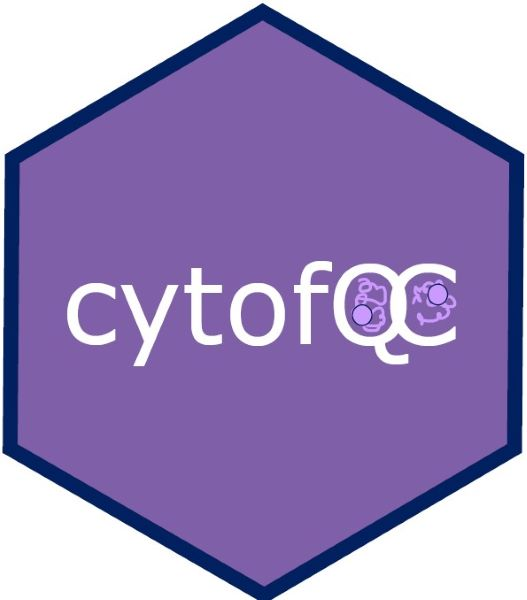
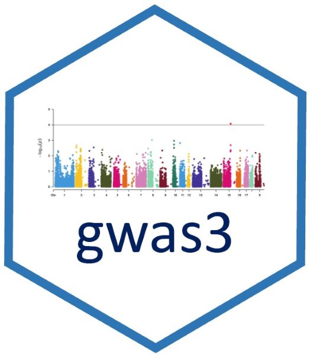

:::: {style="display: flex;"}

::: {.column width="25%"}

{width=90%}

:::

::: {.column width="75%"}
### Automatic tuning of machine learning algorithms

EZtune is an R package that automatically tunes support vector machines, boosted trees, and elastic net. It can tune both regression and binary classification models. It is designed to be computationally fast, find a well tuned model, and be very easy to use. EZtune can be downloaded from CRAN or from [https://github.com/jillbo1000/EZtune](https://github.com/jillbo1000/EZtune).

:::

::::

:::: {style="display: flex;"}

::: {.column width="25%"}

{width=90%}

:::

::: {.column width="75%"}
### Package for cleaning CyTOF data 

cytofQC can be downloaded from Github and is currently under review with Bioconductor. The package can import an fcs file and identify events that are beads, debris, aggregates, or permeable using a statistical modeling approach. Events are labeled with the most likely event type and metrics are provided that indicate how much each event resembles the different event types. Plotting and reporting functions are also included. cytofQC is coming soon to Bioconductor, but can be installed from [https://github.com/jillbo1000/cytofQC](https://github.com/jillbo1000/cytofQC).

:::

::::

:::: {style="display: flex;"}

::: {.column width="25%"}

{width=90%}

:::

::: {.column width="75%"}
### Package for analyzing immune receptor repertoire data 

VDJdive can be downloaded from Bioconductor. The package contains functions for reading immune receptor repertoire data, merging it with paired single cell data, quantifying clonotype abundances, calculating diversity metrics, and producing graphs. It implements an E-M algorithm to make use of ambiguous cells for improved quantification. [https://github.com/kstreet13/VDJdive](https://github.com/kstreet13/VDJdive).
:::

::::

:::: {style="display: flex;"}

::: {.column width="25%"}

{width=90%}

:::

::: {.column width="75%"}
### Package with helpful GWAS tools including a data simulator 

gwas3 is a package I developed when experimenting with some gwas methods. It contains functions for using CART or elastic net for SNP filtering. The methods was not fully explored, but the package contains a GWAS data simulator that is helpful. The package can be installed from  [https://github.com/jillbo1000/gwas3](https://github.com/jillbo1000/gwas3).
:::

::::
